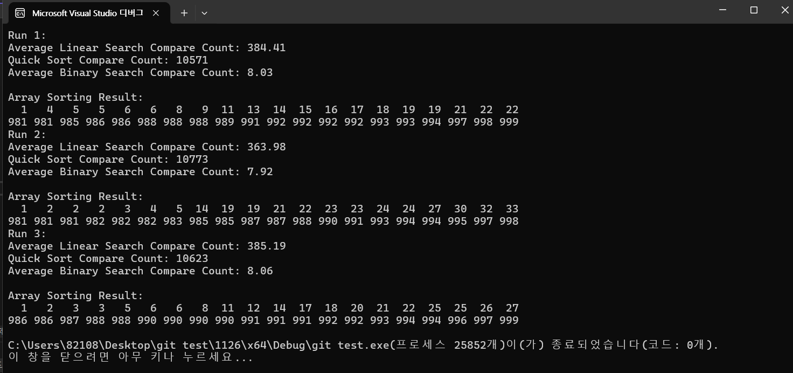

순차 탐색 (Linear Search): 순차 탐색은 배열의 첫 번째 요소부터 마지막 요소까지 차례로 비교를 진행합니다. 데이터가 정렬되어 있지 않으면 모든 요소를 확인해야 할 수 있어 최악의 경우에는 N번의 비교가 필요합니다.
이진 탐색 (Binary Search): 이진 탐색은 데이터가 정렬된 상태에서만 작동합니다. 정렬된 배열의 중간 요소와 목표값을 비교하고, 목표값이 중간 요소보다 작거나 큰지를 판단하여 탐색 범위를 절반으로 줄입니다. 이 과정은 log2(N) 번의 비교로 수행됩니다. 따라서 데이터가 정렬된 상태에서 이진 탐색은 매우 효율적입니다.
순차 탐색의 최악의 경우는 N번의 비교입니다.
이진 탐색의 최악의 경우는 O(logN)번의 비교입니다.

데이터가 퀵 정렬을 통해 정렬된 후 이진 탐색을 사용하면 상대적으로 적은 비교 횟수로 목표값을 찾을 수 있습니다.

예를 들어
정렬되지 않은 배열: [3, 1, 4, 2, 5]
정렬된 배열: [1, 2, 3, 4, 5]
순차 탐색: 목표값이 4일 경우, [3, 1, 4]를 순차적으로 비교해야 하므로 3번의 비교가 필요합니다.
이진 탐색: 정렬된 배열에서 4를 찾을 때, 중간값이 3이므로 4가 더 크다는 것을 확인한 후 오른쪽 절반(4, 5)으로 범위를 줄여 한 번의 비교로 4를 찾을 수 있습니다. 이 경우 총 2번의 비교로 목표값을 찾을 수 있습니다.

따라서, 퀵 정렬 후 이진 탐색을 사용하면 데이터의 정렬 상태 덕분에 비교 횟수를 크게 줄일 수 있으며, 이는 효율적인 탐색 방법입니다.
