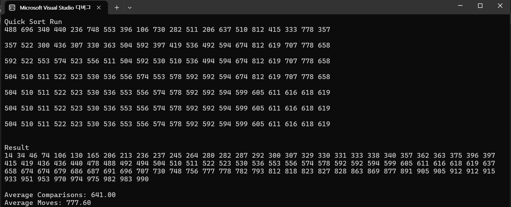

선택정렬: 구현이 간단하며 추가 메모리가 필요없다. 느리고 비효율적이다. 데이터셋이 작을 때 사용하면 좋다.

삽입정렬: 정렬된 데이터에서 매우 효율적이다. 큰 데이터셋에서는 비효율적이며 데이터가 거의 정렬된 경우가 적합하다.

버블정렬: 구현이 매우 간단하며 가장 비효율적이다. 학습 목적으로만 사용하는 것이 적합하다.

쉘 정렬: 빠르고 메모리 추가 사용이 없다. 안정적이지 않으며 중간 크기의 데이터셋일 때 적합하다.

합병 정렬: 안정적이고 빠르다. 추가 메모리가 필요하며 안정성이 중요한 경우 사용하는 것이 좋다.

퀵 정렬: 평균적으로 가장 빠르며 피벗 선택이 나쁘면 느리다. 가장 일반적으로 사용된다.

