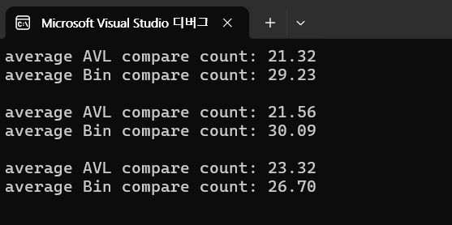

AVL 트리: 평균 비교 횟수가 더 작게 나올 가능성이 높습니다. AVL 트리는 항상 균형 상태를 유지하기 때문에, 탐색 경로의 길이가 더 짧아 비교 횟수가 적습니다.
평균적으로 O(logn)의 탐색 성능을 보여줍니다.

BST: 트리가 한쪽으로 치우친 경우, 탐색 경로가 길어지고 비교 횟수가 증가할 수 있습니다. 삽입 순서에 따라 트리가 한쪽으로 치우치는 경우가 많아 최악의 경우 O(n)까지 성능이 저하됩니다.

AVL 트리는 삽입 및 삭제 시 약간의 추가 연산(회전)이 필요하지만 탐색 성능은 항상 균형 잡힌 상태를 유지합니다.
BST는 구현이 단순하지만 트리의 균형이 깨질 경우 성능이 급격히 저하될 수 있습니다.
데이터가 크거나 탐색 작업이 많은 경우 AVL 트리를 사용하는 것이 권장됩니다.
