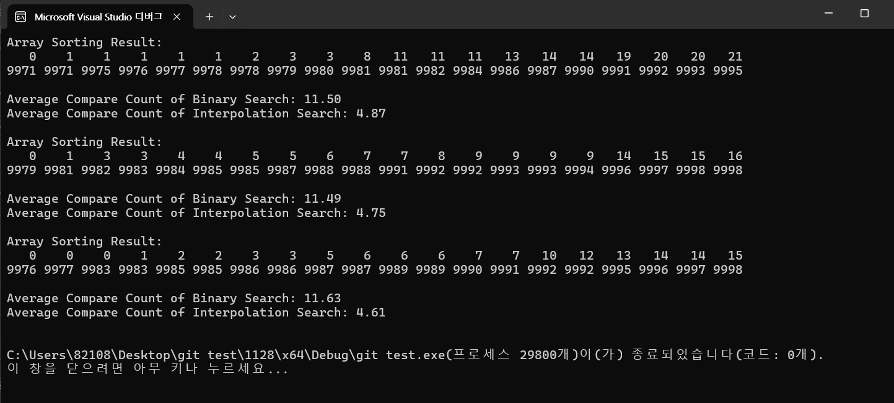

1. 데이터 분포 이용
Binary Search는 배열의 중간 값을 기준으로 탐색 범위를 반으로 나누는 방식입니다. 데이터가 정렬되어 있지만, 값의 분포와는 무관하게 중간을 선택합니다.
Interpolation Search는 데이터의 분포를 고려하여, 탐색할 값이 배열의 어떤 위치에 있을지를 예측합니다.
이 과정에서 배열의 최소값과 최대값을 사용하여 상대적인 위치를 계산합니다.

2. 선형 분포에서 효율성
Interpolation Search는 배열의 값이 균등하게 분포되어 있을 때 그 효율성이 극대화됩니다.
예를 들어 값이 고르게 분포된 경우, 탐색할 값이 어느 위치에 있을지를 빠르게 추정할 수 있어 더 적은 비교 횟수로 원하는 값을 찾을 수 있습니다.
반면, 값의 분포가 고르지 않다면 Interpolation Search의 성능은 저하될 수 있습니다.
이 경우 Binary Search가 더 안정적인 성능을 보일 수 있습니다.

3. 비교 횟수
Binary Search는 매번 중간 값을 찾기 위해 항상 1회의 비교를 수행합니다.
반면, Interpolation Search는 예측된 위치를 사용하여 더 많은 비교를 한 번에 처리할 수 있습니다.

4. 결론
Interpolation Search는 데이터의 분포에 따라 효율성을 발휘할 수 있는 탐색 알고리즘입니다.
데이터가 균등하게 분포되어 있을 때, 평균적으로 더 적은 비교 횟수로 탐색을 완료할 수 있습니다.
하지만 비균등한 분포에서는 Binary Search가 더 안정적일 수 있습니다.
